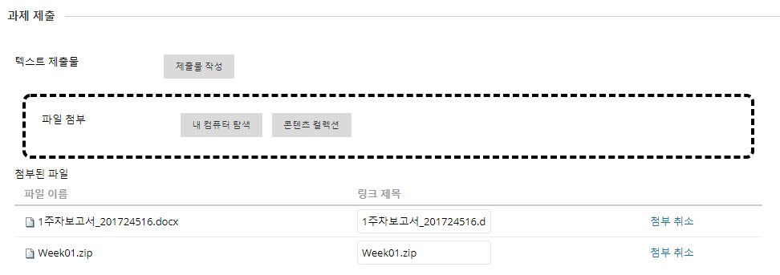

# 아주대학교 자료구조 실습 자료

2018학년도 자료구조 실습 수업을 위한 자료입니다.

프로그래밍이나 개발 환경에 익숙하지 않은 학생은 본 레파지토리를 그대로 다운받아 사용하기를 권장합니다. 아래의 안내 사항을 자세히 읽어보시고 궁금한 점은 조교에게 질문해주시기 바랍니다.

각 하위 폴더는 Visual Studio 솔루션으로 구성되어 있으며 각 주차의 실습 과제들을 프로젝트로 포함합니다. 윈도우 사용자인 경우 각 솔루션 폴더의 ```.sln``` 파일을 실행하면 간단히 열 수 있습니다.

솔루션 폴더에는 해당 주차의 실습 프로젝트들이 포함되어 있습니다. 각각의 프로젝트를 독립적으로 완성하면 됩니다.
<br>
<br>
<br>

## 실습 보고서 제출하기

매 주 실습 이후에는 아주Bb에 실습 보고서를 제출해야 합니다. 본 레파지토리에 각 주차별 솔루션 폴더에는 보고서 파일이 포함되어 있습니다. 해당 파일을 이용해 보고서를 작성한 이후에 모든 소스코드와 함께 제출해야 합니다.

보고서에는 해당 주차의 실습 내용과 본인 코드의 실행 결과를 **정말 간략히** 만 정리해주세요. 거창하게 작성 할 필요는 없습니다.

- 소스코드는 [여기](http://markup.su/highlighter//)에서 <code>IDLE</code> 형식으로 변환한 이후에 붙여 넣어 주세요!
- 실행 결과 캡처 가장 윗줄에 본인의 학번과 이름이 나올 수 있도록 해주세요.
- 압축 파일 형식은 <code>.Zip</code>으로 통일해주시고, 보고서는 <code>.PDF</code>나 <code>.docx</code> 확장자여야 합니다.
- MS WORD가 아닌 다른 프로그램으로 보고서를 작성해도 무관하지만, 꼭 <code>.PDF</code>로 변환하여 제출해주세요.
- 특히 <code>.hwp</code>로 제출하지 마세요. **절대로**

<br>

**최종 제출 파일은 총 두 개입니다**
1. 해당 주차 실습 솔루션(소스코드들)을 압축한(<code>.zip</code>) 파일
2. 해당 주차의 보고서(<code>.docx</code>) 파일 **(압축 하지 마세요)**

- 

<br>


## 다른 운영체제 및 개발환경 사용자의 경우

Visual Studio가 아닌 다른 개발환경을 사용하거나, 다른 운영체제에서 실습을 진행하고 싶은 경우 아래 사항을 유의해주세요.
- 다른 컴파일러(gcc, clang)를 사용하는 경우 <code>C99</code>버전 기준으로 실습을 진행하시기 바랍니다.
- 실습 보고서와 소스코드가 정확히 포함되어 있다면 무관합니다. 소스코드는 <code>.c</code>확장자 이어야 합니다.
- 전체 폴더 구조는 똑같이 유지해주시길 바랍니다.
- 과제 제출시 파일 포멧을 꼭 지켜주세요. (위의 보고서 제출 방법 참조)
