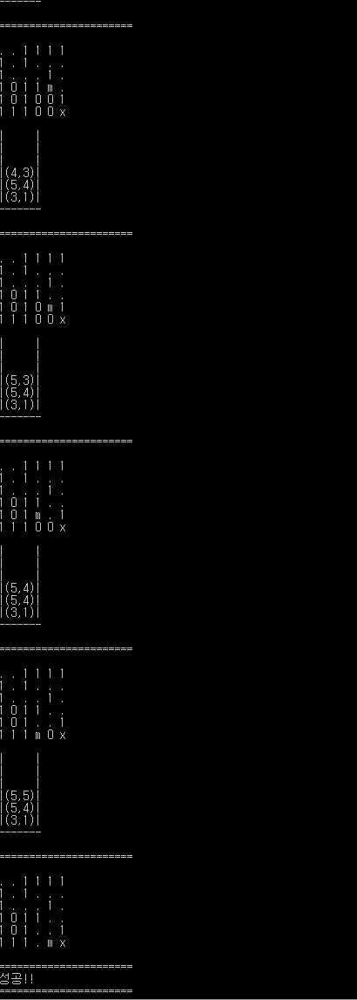

## Output Example 01

for input <code>"(a/(b-c+d))*(e-a)*c"</code>

expected output is <code>abc-d+/ea-*c*</code>

Output Example 02

for input 
```c++
char maze[MAZE_SIZE][MAZE_SIZE] = {
	{ 'e', '0', '1', '1', '1', '1' },
	{ '1', '0', '1', '0', '0', '0' },
	{ '1', '0', '0', '0', '1', '0' },
	{ '1', '0', '1', '1', '0', '0' },
	{ '1', '0', '1', '0', '0', '1' },
	{ '1', '1', '1', '0', '0', 'x' },
};
```

## Output Example 02


